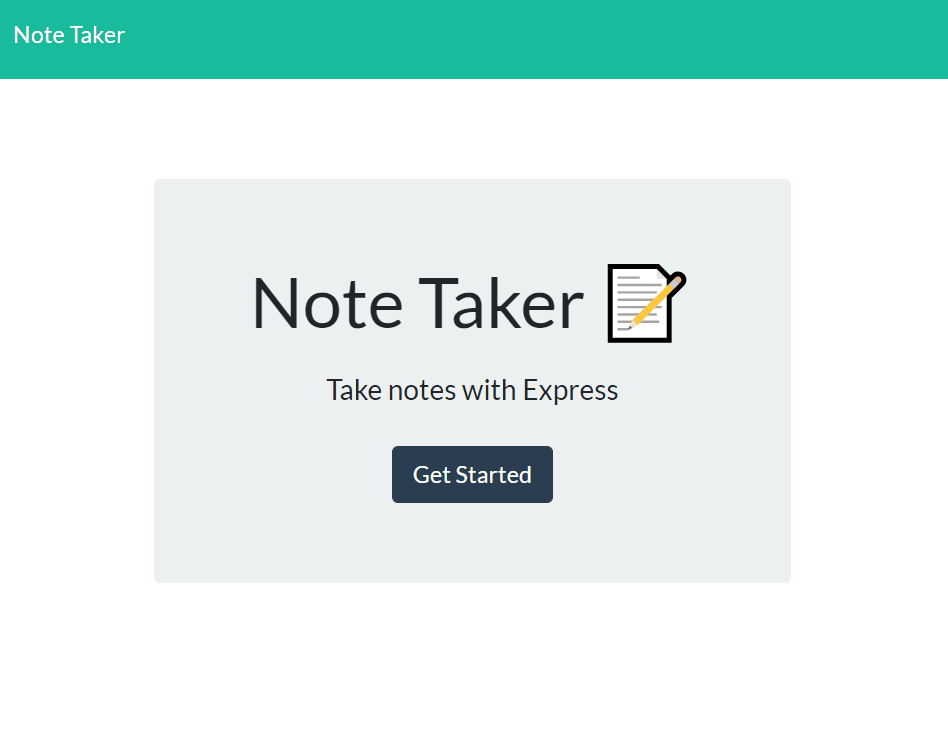

# Duly Noted
 

## Info: 
This application allows the user to input and save notes, using express to make a server

## Table of Contents 
 1.[Installation](#Installation) 
 2.[Usage](#Usage) 
 3.[License](#License) 
 4.[Contributing](#Contributing) 
 5.[Tests](#Tests) 
 6.[Questions](#Questions)

### Installation:
Application is hosted on heroku, so there is no need to install
https://safe-hamlet-41372.herokuapp.com/

### Usage:
 Simply open using the provided heroku link, click on "Get Started", and start taking notes! clicking the pencil icon will start a new note, and after entering a title and the content for your note, click the save icon to add it to your list of notes. within that list, simply click on the note you'd like to look at, or on the trash icon on the right of the note to delete it.

#### In Use:

### License:
 This project is licensed under the MIT license.

### Contributing:
Refactoring of the code is always appreciated

### Tests:
Testing at this stage is as simple as trying to break the application

### Questions:
To contact the author of this repository, reach them via: 
Github: https://github.com/matt-boggs
Email: matt.david.boggs@gmail.com